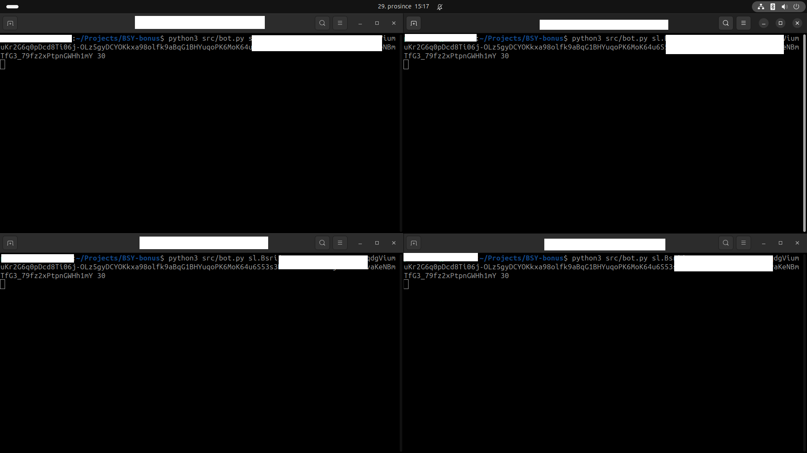
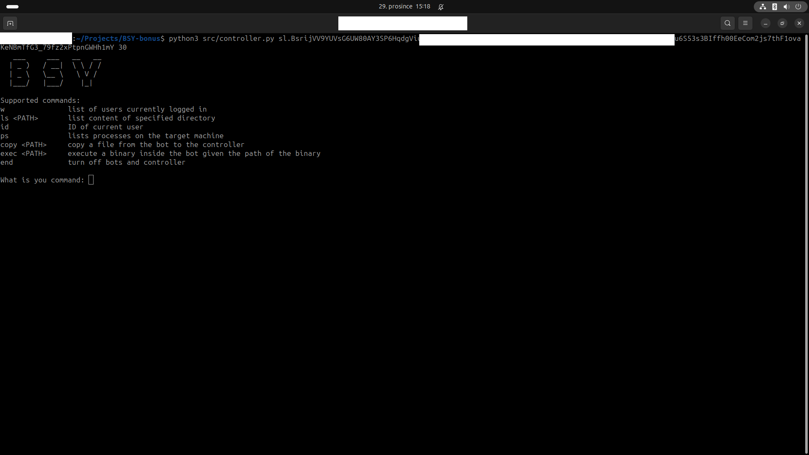
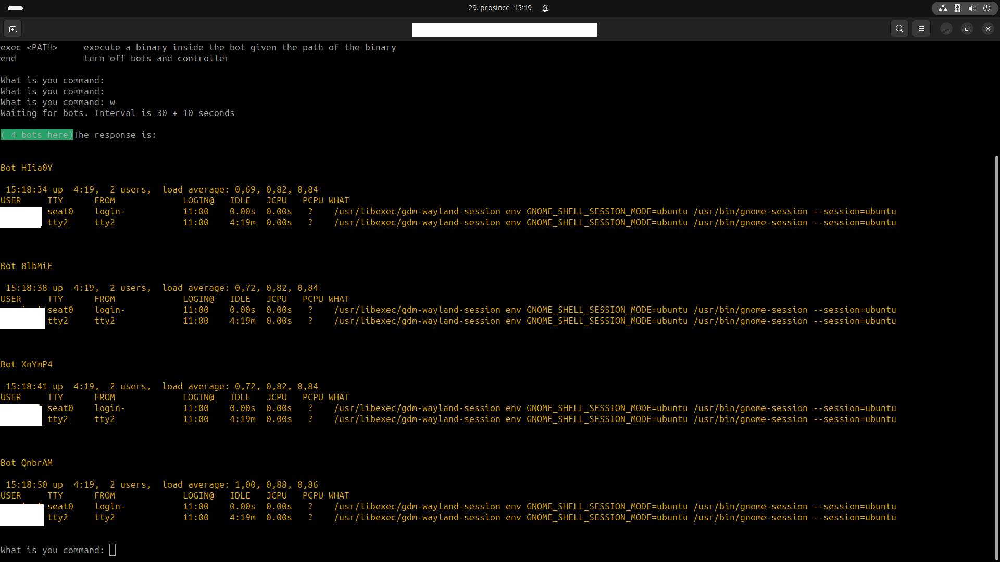
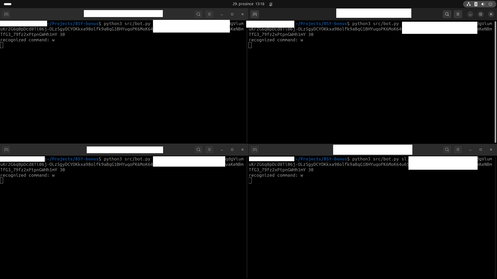
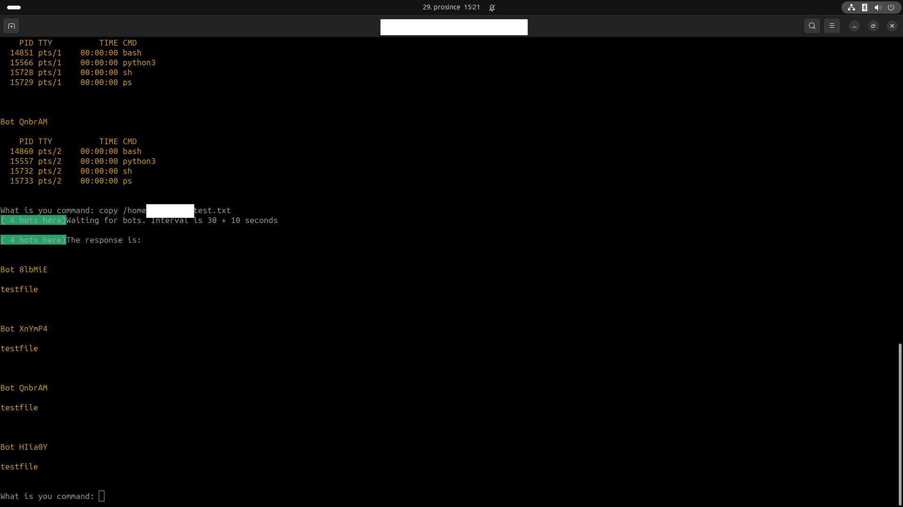
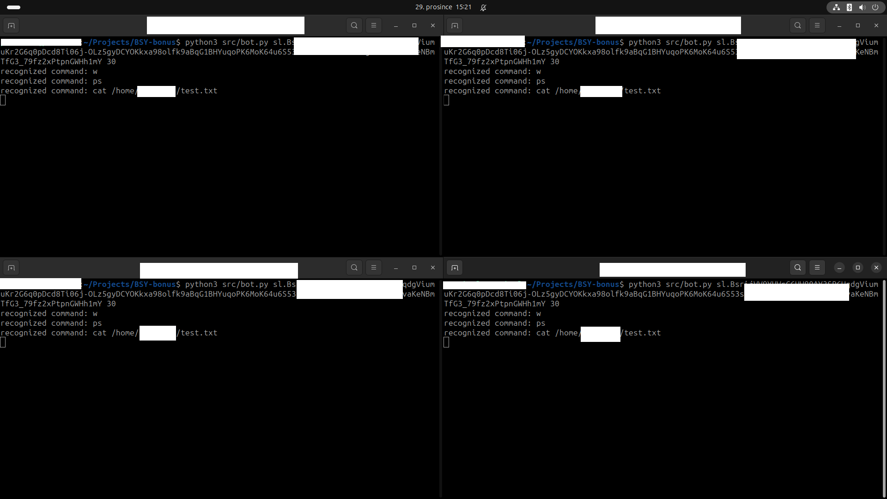
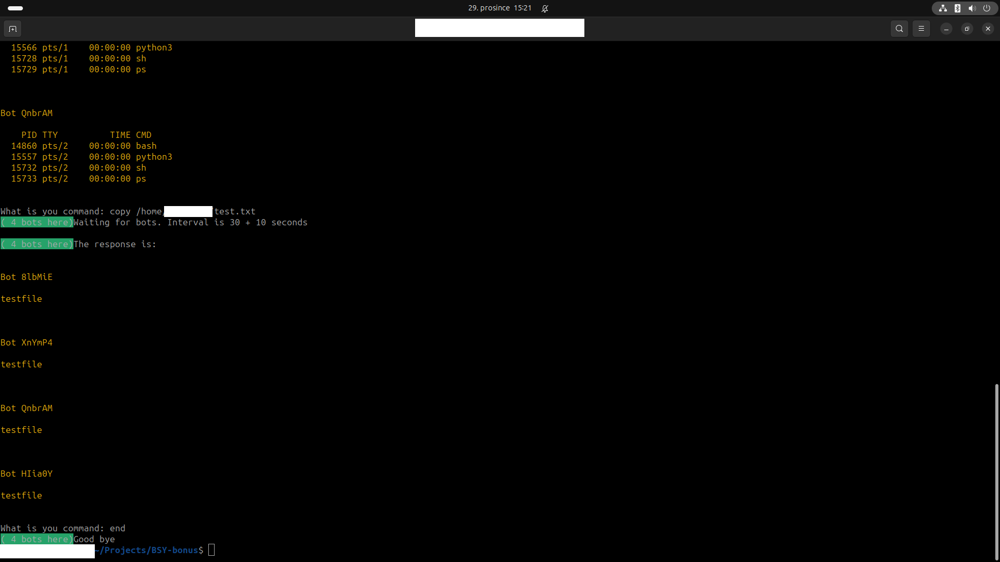
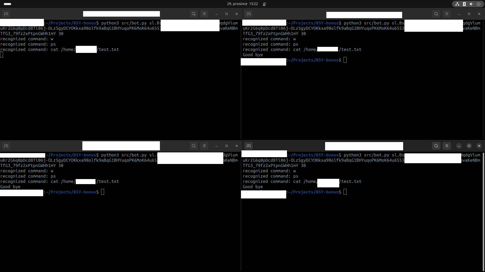

# BSY Bonus

1. Your task is to write the bot code and the controller code. The bot will be the infected computer, and the controller is what you use to control the bots.

2. Both parts should use www.dropbox.com to communicate. You can register a free account and create a new application that uses the Python SDK (dropbox library) to upload and download files, etc.

3. The goal is to run some of your bots as 'infected' computers in the dropbox channel, and you also connect to this channel with your controller to control them.

4. The communication between the bots and the controller should not be easily detected as 'bots' in the channel, therefore all communication should look like normal English markdown or text (text, images and emojis are accepted). You should use some steganography technique to hide your messages as English.

5. The controller should check if the bots are alive periodically.

6. The controller should give orders to the bot and the bot should answer the output of the orders
The minimum orders are the following commands:
	- w (list of users currently logged in)
	- ls <PATH> (list content of specified directory)
	- id (if of current user)
	- Copy a file from the bot to the controller. The file name is specified
	- Execute a binary inside the bot given the name of the binary. Example: ‘/usr/bin/ps’

7. Publish the whole code in github and put the link as a flag for this stage. Make sure you do not publish your API keys!!!

8. Provide sufficient documentation on how to setup and use the client and the server so that we can test it.


## Documentation

### Requirements

`pip install -r requirements.txt`

### Run

Controller

```
python3 src/controller.py <API-KEY> <PERIOD>
```

Bot

```
python3 src/bot.py <API-KEY> <PERIOD>
```

- `API-KEY` is your api key to dropbox.com
- `PERIOD` is time in seconds to for heartbeat and sync with dropbox

### Heartbeat

Heartbeat is every `PERIOD` seconds. You will get messages about it.

### Commands

| Command          | Description                                                        |
|------------------|--------------------------------------------------------------------|
| `w`              | List of users currently logged in                                 |
| `ls <PATH>`      | List content of the specified directory                            |
| `id`             | ID of the current user                                             |
| `ps`             | List processes on the target machine                               |
| `copy <PATH>`    | Copy a file from the bot to the controller                         |
| `exec <PATH>`    | Execute a binary inside the bot given the path of the binary       |
| `end`            | Turn off bots and controller                                       |

After calling command it is necessary to wait `PERIOD` + 10 seconds for response. You will get messages about it.

### Encryption

All commands are hidden in shopping list (`/shopping_list.txt`).

Example:

```
on 15 day buy wine
on -92 day buy alive cat
on -93 day buy alive cat
on 16 day buy list !A!N!D! Cat Penguin Grape Ice Grape Penguin Grape Notebook Grape Fish Cat Penguin Hat Apple Grape Banana Hat Cat Hat Kangaroo Grape Jacket Hat Grape Grape Banana Grape Monkey
on -94 day buy alive cat
on 18 day buy identity
on -95 day buy alive cat
on -96 day buy alive cat
on -97 day buy alive cat
on 19 day buy copy machine !A!N!D! Cat Penguin Grape Ice Grape Penguin Grape Notebook Grape Fish Cat Penguin Hat Apple Grape Banana Hat Cat Hat Kangaroo Grape Jacket Hat Grape Grape Banana Grape Monkey Cat Penguin Hat Elephant Grape Fish Hat Dog Hat Elephant Cat Orange Hat Elephant Hat Ice Hat Elephant
on -98 day buy alive cat
```

Each bot creates file with `COUNTER` in name and contains encrypted response.

Example of name: `what_i_bought_on_day_12_XhnADs.txt` (`12` is counter and `XhnADs` is bot name)

Example of content:

```
Cat Apple Dog Cat Dog Cat Dog Kangaroo Dog Fish Dog Hat Dog Kangaroo Dog Elephant Dog Dog Cat Apple Hat Fish Hat Apple Cat Apple Cat Apple Dog Elephant Dog Kangaroo Dog Fish Dog Jacket Cat Monkey Cat Apple Cat Apple Dog Cat Cat Apple Hat Fish Hat Dog Grape Fish Hat Cat Hat Dog Cat Monkey Cat Apple Cat Apple Grape Monkey Grape Penguin Grape Banana Grape Elephant Cat Apple Grape Banana Hat Grape Grape Fish Hat Cat Grape Banana Grape Hat Grape Fish Dog Kangaroo Cat Apple Dog Apple Cat Monkey Dog Fish Dog Banana Cat Monkey Cat Apple Dog Apple Cat Monkey Dog Grape Dog Fish Cat Monkey Cat Apple Dog Apple Cat Monkey Dog Jacket Dog Dog Apple Kangaroo Fish Fish Fish Dog Elephant Fish Fish Cat Cat Apple Cat Apple Cat Apple Cat Apple Cat Apple Fish Elephant Fish Elephant Fish Jacket Cat Apple Cat Apple Cat Apple Cat Apple Cat Apple Cat Apple Elephant Grape Fish Cat Elephant Penguin Elephant Notebook Cat Apple Cat Apple Cat Apple Cat Apple Cat Apple Cat Apple Cat Apple Cat Apple Cat Apple Cat Apple Cat Apple Cat Apple Cat Apple Elephant Monkey Elephant Penguin Elephant Hat Elephant Jacket Elephant Orange Elephant Apple Cat Apple Cat Apple Cat Apple Elephant Jacket Elephant Elephant Elephant Monkey Elephant Fish Cat Apple Cat Apple Cat Apple Elephant Kangaroo Elephant Dog Fish Apple Fish Fish Cat Apple Cat Apple Cat Apple Fish Apple Elephant Dog Fish Apple Fish Fish Cat Apple Fish Hat Elephant Ice Elephant Banana Fish Elephant Apple Kangaroo Hat Apple Grape Banana Hat Cat Hat Kangaroo Grape Jacket Hat Grape Grape Banana Grape Monkey Cat Apple Hat Dog Grape Fish Grape Banana Hat Elephant Dog Apple Cat Apple Cat Apple Cat Apple Cat Apple Grape Monkey Grape Penguin Grape Hat Grape Jacket Grape Orange Cat Notebook Cat Apple Cat Apple Cat Apple Cat Apple Cat Apple Cat Apple Cat Apple Cat Apple Cat Apple Cat Apple Cat Apple Dog Banana Dog Hat Dog Kangaroo Dog Fish Dog Jacket Cat Apple Cat Apple Cat Apple Cat Apple Dog Apple Cat Orange Dog Apple Dog Apple Hat Dog Cat Apple Cat Apple Dog Apple Cat Orange Dog Apple Dog Apple Hat Dog Cat Apple Cat Apple Cat Apple Dog Penguin Cat Apple Cat Apple Cat Apple Cat Apple Cat Penguin Hat Fish Hat Dog Hat Cat Cat Penguin Grape Monkey Grape Jacket Grape Cat Grape Fish Hat Ice Grape Fish Grape Dog Cat Penguin Grape Hat Grape Elephant Grape Notebook Cat Notebook Hat Hat Grape Banana Hat Jacket Grape Monkey Grape Banana Grape Orange Grape Elephant Cat Notebook Hat Dog Grape Fish Hat Dog Hat Dog Grape Jacket Grape Penguin Grape Orange Cat Apple Grape Fish Grape Orange Hat Grape Cat Apple Elephant Hat Elephant Orange Elephant Penguin Elephant Notebook Elephant Fish Fish Penguin Fish Dog Elephant Ice Elephant Fish Elephant Monkey Elephant Monkey Fish Penguin Fish Dog Elephant Fish Fish Dog Fish Dog Elephant Jacket Elephant Penguin Elephant Orange Fish Penguin Elephant Notebook Elephant Penguin Elephant Elephant Elephant Fish Dog Notebook Hat Fish Grape Cat Hat Fish Grape Orange Hat Elephant Hat Fish Cat Apple Cat Penguin Hat Fish Hat Dog Hat Cat Cat Penguin Grape Cat Grape Jacket Grape Orange Cat Penguin Grape Hat Grape Orange Grape Penguin Grape Notebook Grape Fish Cat Notebook Hat Dog Grape Fish Hat Dog Hat Dog Grape Jacket Grape Penguin Grape Orange Cat Apple Cat Notebook Cat Notebook Hat Dog Grape Fish Hat Dog Hat Dog Grape Jacket Grape Penguin Grape Orange Dog Notebook Hat Fish Grape Cat Hat Fish Grape Orange Hat Elephant Hat Fish Apple Kangaroo Hat Apple Grape Banana Hat Cat Hat Kangaroo Grape Jacket Hat Grape Grape Banana Grape Monkey Cat Apple Hat Elephant Hat Elephant Hat Jacket Dog Cat Cat Apple Cat Apple Cat Apple Cat Apple Cat Apple Hat Elephant Hat Elephant Hat Jacket Dog Cat Cat Apple Cat Apple Cat Apple Cat Apple Cat Apple Cat Apple Cat Apple Cat Apple Cat Apple Cat Apple Cat Apple Cat Apple Cat Apple Dog Banana Dog Hat Dog Kangaroo Dog Fish Dog Jacket Cat Apple Cat Apple Cat Apple Cat Apple Dog Elephant Dog Kangaroo Dog Fish Dog Ice Grape Notebook Cat Apple Cat Apple Dog Apple Cat Orange Dog Apple Dog Banana Hat Dog Cat Apple Cat Apple Dog Apple Cat Orange Dog Apple Dog Banana Hat Dog Cat Apple Cat Penguin Hat Fish Hat Dog Hat Cat Cat Penguin Grape Monkey Grape Jacket Grape Cat Grape Fish Hat Ice Grape Fish Grape Dog Cat Penguin Grape Hat Grape Orange Grape Penguin Grape Notebook Grape Fish Cat Notebook Hat Dog Grape Fish Hat Dog Hat Dog Grape Jacket Grape Penguin Grape Orange Cat Notebook Grape Cat Grape Jacket Grape Orange Grape Banana Hat Cat Hat Jacket Cat Apple Cat Notebook Cat Notebook Hat Dog Grape Fish Hat Dog Hat Dog Grape Jacket Grape Penguin Grape Orange Dog Notebook Hat Fish Grape Cat Hat Fish Grape Orange Hat Elephant Hat Fish Apple Kangaroo
```

**After reading response in controller the files are deleted!**

### Screenshots

### INIT




### W command




### Copy command




### End command





## Disclaimer

Users are solely responsible for ensuring that their use of this code complies with all applicable laws and regulations. Any use of this code for illegal or unethical activities is strictly prohibited. By using this code, you agree to use it in a manner that is lawful, ethical, and respectful of others' rights.
